### **Añadir paciente**
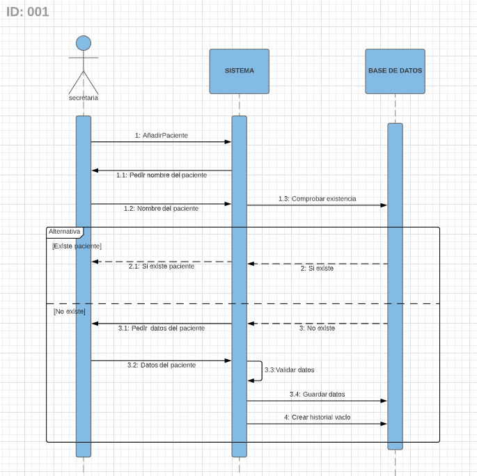
### **Mostrar lista de pacientes**
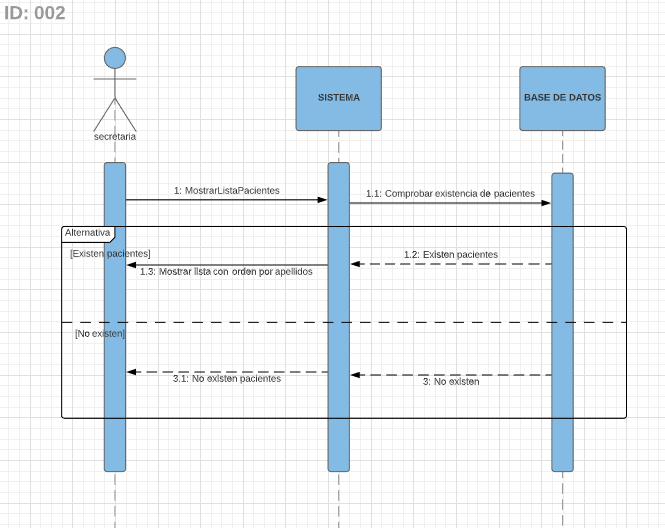
### **Borrar paciente**
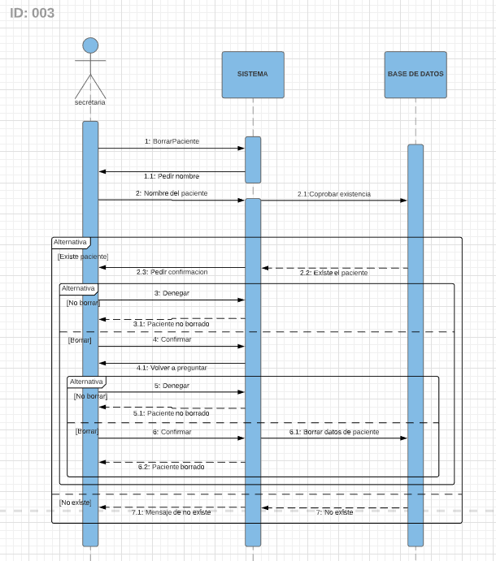
### **Mostrar paciente**
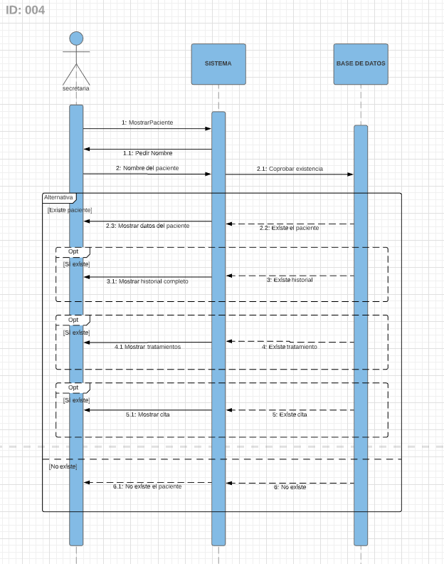
### **Mostrar citas**
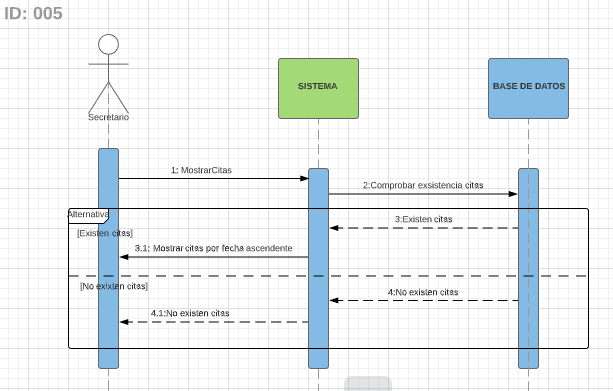
### **Modificar datos de los pacientes**
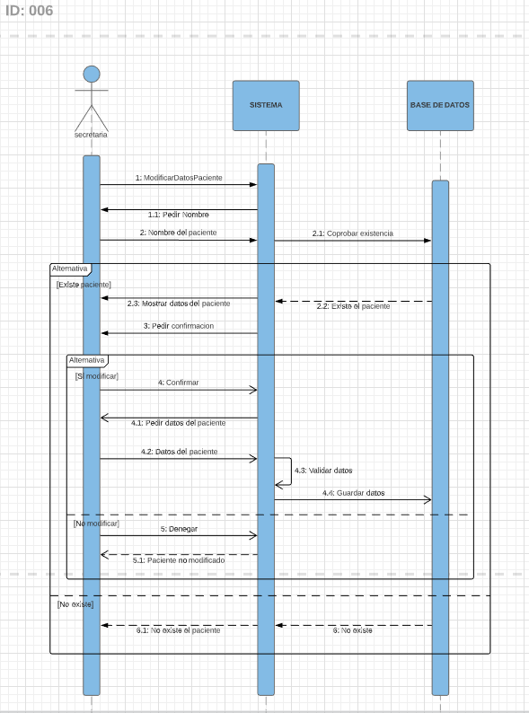
### **Añadir en historial**
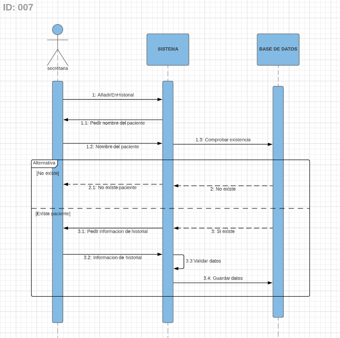
### **Añadir cita**
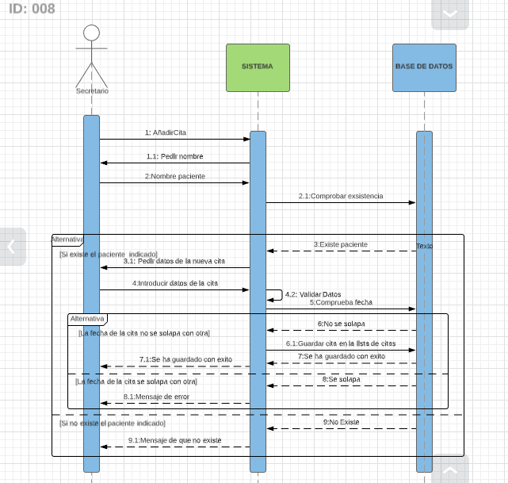
### **Añadir tratamiento**
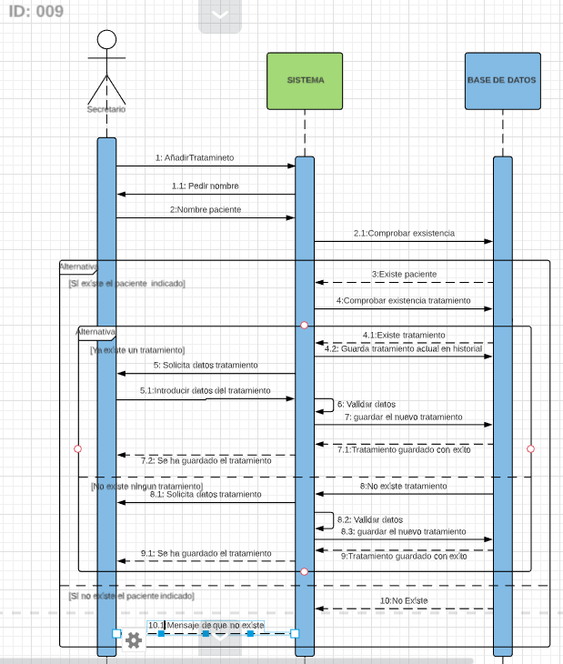
### **Cancelar tratamiento**
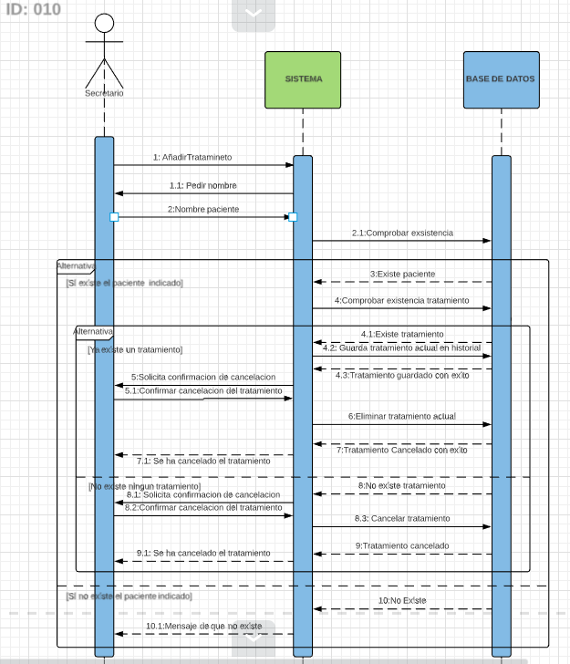
### **Mover cita**
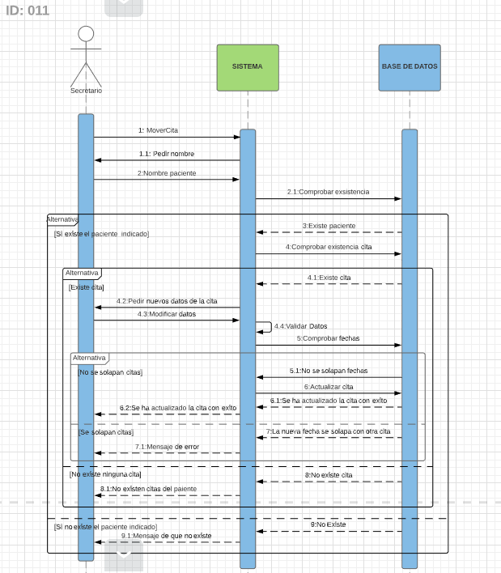
### **Cancelar cita**

